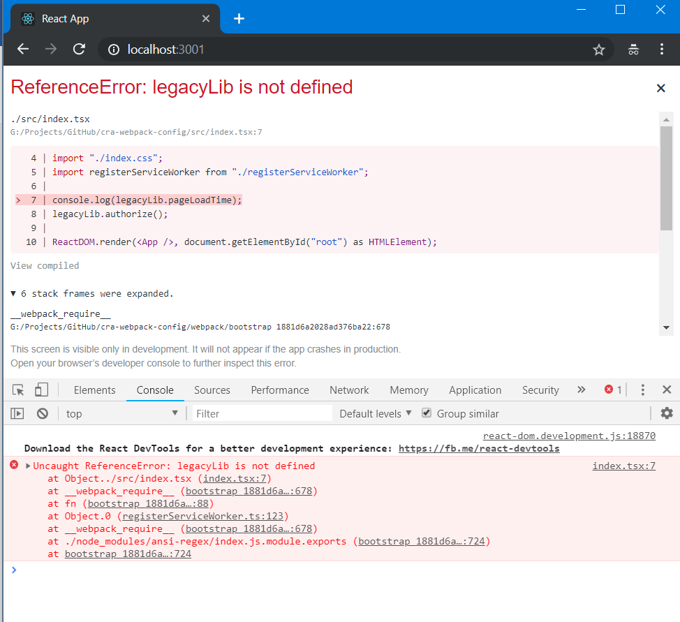

# Configure webpack config of React App created with Create-react-app

It was Saturday night hanging around to solve the issue of “ReferenceError: legacyLib is not defined” in my React+Typescript app. I was sure that this error was about my "legacyLib.js" lib file, which included thousands of lines of code coded as IIFE, which wasn't bundled by webpack by default. 



I could solved the issue by manually copying the "legacyLib.js" file to my app folder or by serving over CDN as follows, but I prefered to do this work by webpack. So let's start the journey of configuring create-react-app webpack.config.js. 

```html
<!DOCTYPE html>
<html lang="en">
  <head>
      <script type="text/javascript" src="/dist/legacyLib.js"></script>
  </head>
  <body>

  </body>
</html>
```
public/index.html

[Create-React-App](https://github.com/facebook/create-react-app/issues/99#issuecomment-234657710)   

