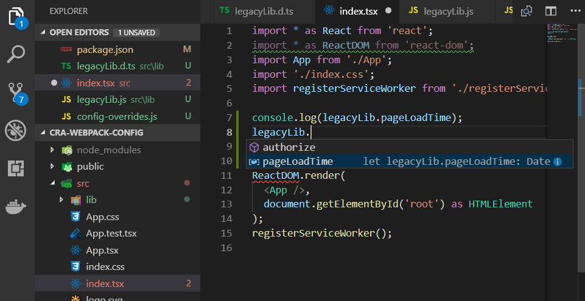
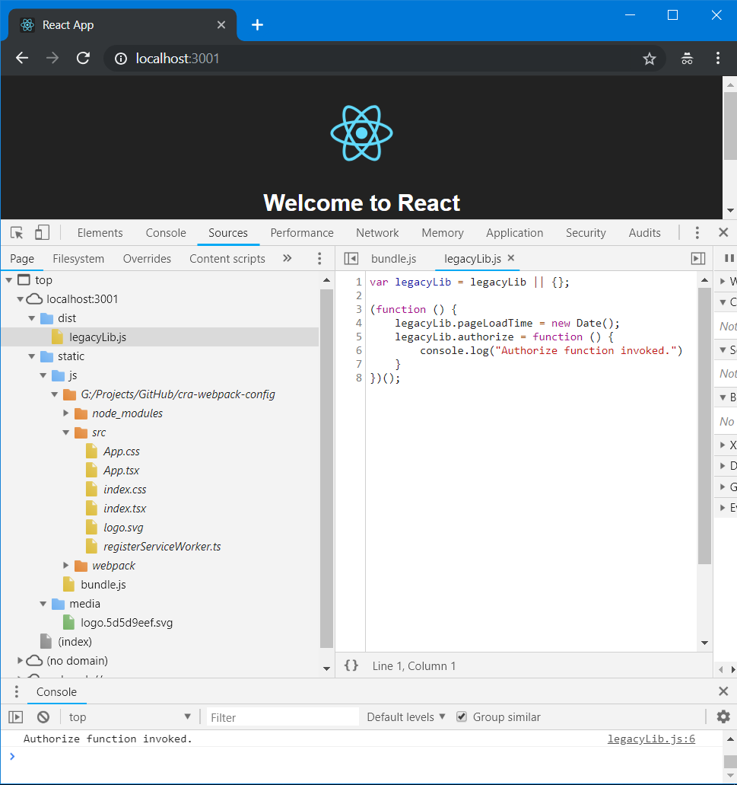

# Configure webpack config of React App created with Create-react-app

It was Saturday night hanging around to solve the issue of [“ReferenceError: legacyLib is not defined”](_screenshots/referenceError-legacylib-is-not-defined.png) in my React+Typescript app. I was sure that this error was about my "legacyLib.js" lib file, which included thousands of lines of code coded as IIFE, [which wasn't bundled by webpack by default]((_screenshots/sourceview-before.png)).

```text
ReferenceError: legacyLib is not defined
./src/index.tsx
G:/Projects/GitHub/cra-webpack-config/src/index.tsx:7
   4 | import "./index.css";
   5 | import registerServiceWorker from "./registerServiceWorker";
   6 | 
>  7 | console.log(legacyLib.pageLoadTime);
   8 | legacyLib.authorize();
   9 | 
  10 | ReactDOM.render(<App />, document.getElementById("root") as HTMLElement);
View compiled
```

I could solved the issue by manually copying the "legacyLib.js" file to my app folder or by serving over CDN as follows, but I prefered to do this work by webpack. So let's start the journey of configuring create-react-app webpack.config.js. 

```html
<!--public/index.html-->

<!DOCTYPE html>
<html lang="en">
  <head>
      <script type="text/javascript" src="/dist/legacyLib.js"></script>
  </head>
  <body>

  </body>
</html>
```

## The issue: "ReferenceError: legacyLib is not defined"

For the sake of simplicity I simplified the "lib.js" and created "legacyLib.js" which is a IIFE function with several lines of code. In order to use "legacyLib.js" with Typescript I defined "legacyLib.d.ts" typescript definition file.

```javascript
// src/lib/legacyLib.js

var legacyLib = legacyLib || {};

(function () {
    legacyLib.pageLoadTime = new Date();
    legacyLib.authorize = function () {
        console.log("Authorize function invoked.")
    }
})();
```

```ts
// src/lib/legacyLib.d.ts

declare namespace legacyLib {
  let pageLoadTime: Date;
  function authorize(): void;
}
```

While coding react app, linter and intellisense was happy with coding. I coded as usual. I was feeling happy that without importing any module in my tsx documents, webpack will understand that I am using "legacyLib.js" and will include "legacyLib.js" in [Dependency Graph](https://webpack.js.org/concepts/dependency-graph/), then bundles accordingly.



My happiness distracted after running npm start:

```sh
npm run start
```

Webpack bundled resources and devserver started without any errors. When browser opened the scary error was there.

```text
ReferenceError: legacyLib is not defined
./src/index.tsx
G:/Projects/GitHub/cra-webpack-config/src/index.tsx:7
...
``` 
It was the time that webpack should be configured for react app which was created with create-react-app package. So, I started to configure webpack configurations. 

## Solution

In order to recreate the issue let's start by creating the app from scratch. By executing the following command we are creating the project.

```shell
create-react-app cra-webpack-config --scripts-version=react-scripts-ts
```

When command execution completes we will have the following project folder structure:

```text
cra-webpack-config/
├─ .gitignore
├─ images.d.ts
├─ node_modules/
├─ public/
├─ src/
│  └─ ...
├─ package.json
├─ tsconfig.json
├─ tsconfig.prod.json
├─ tsconfig.test.json
└─ tslint.json
```

As you can see that we don't have any webpack.config.js file in our project. That's because [Create-React-App](https://github.com/facebook/create-react-app/issues/99#issuecomment-234657710) states that we are not allowed to override webpack specific configurations. But we have chance to do so, let's have a try!

Our motivation was let the webpack to copy "legacyLib.js" file to build directory. So here plays the [CopyWebpackPlugin](https://webpack.js.org/plugins/copy-webpack-plugin/) plugin of webpack, which can do exact job what we want. 

### CopyWebpackPlugin

Webpack has "CopyWebpackPlugin" plugin which copies desired files or directories to the build directory. It is good news that we have chance to modify webpack configuration to copy our desired file to build folder. So let's start by installing "CopyWebpackPlugin" to our app:

```shell
npm install -D copy-webpack-plugin
```

>npm install --save is used when you want a package that should should be bundled in production bundle, if you are using a package to enhance your development experience(e.g jest, webpack, etc.) then use npm install --save-dev or shortly npm i -D.

If our react app project was created manually, we could easily modified webpack configuration by adding webpack.config.js file in root folder of project layout. The following lines would be added to webpack.config.json file when webpack was installed manually:

```diff
// ./webpack.config.js

const path = require('path');
+const CopyWebpackPlugin = require('copy-webpack-plugin')

module.exports = {
    entry: {
        main: './src/index.js'
    },
    output: {
        filename: 'main.js',
        path: path.resolve(__dirname, 'dist')
    },
    module: {
        rules: [{
                test: /\.css$/,
                use: [
                    'style-loader',
                    'css-loader'
                ]
            },
            {
                test: /\.(png|svg|jpg|gif)$/,
                use: [
                    'file-loader'
                ]
            },
            {
                test: /\.(woff|woff2|eot|ttf|otf)$/,
                use: [
                    'file-loader'
                ]
            }
        ]
    },
+   plugins: [ new CopyWebpackPlugin([{from: './src/lib/legacyLib.js'}])]
};
```

### react-app-rewired

Since we have created our project with create-react-app package we can't simply modify webpack.config.json file. In order to achieve our goal we will use react-app-rewired package. So let's install react-app-rewired:

```shell
npm i -D react-app-rewired
```
>The react-app-rewired package is used to configure webpack configurations, so it is development dependency that's why we installed as --save-dev.

After installing react-app-rewired package, manually create config-overrides.js file in the root directory. 

```text
cra-webpack-config/
├─ .gitignore
├─ images.d.ts
├─ node_modules/
├─ public/
├─ src/
│  └─ ...
├─ package.json
├─ tsconfig.json
├─ tsconfig.prod.json
├─ tsconfig.test.json
├─ tslint.json
└─ config-overrides.js
```

```javascript
// config-overrides.js
const CopyWebpackPlugin = require('copy-webpack-plugin');

module.exports = function override(config, env) {
    if (!config.plugins) {
        config.plugins = [];
    }

    config.plugins.push(
        (process.env.NODE_ENV === 'production') ?
        new CopyWebpackPlugin([{from: 'src/lib/legacyLib.js'}]) :
        new CopyWebpackPlugin([{from: 'src/lib/legacyLib.js', to: 'dist'}])
    );

    return config;
}
```

And the last modification in package.json file.

```diff
// package.json

"scripts": {
 -   "start":"react-scripts-ts start",
 +   "start": "react-app-rewired start --scripts-version react-scripts-ts",
 -   "build" "react-scripts-ts build",
 +   "build": "react-app-rewired build --scripts-version react-scripts-ts",
 -   "test": "react-scripts-ts test --env=jsdom",
 +   "test": "react-app-rewired test --env=jsdom --scripts-version react-scripts-ts",
     "eject": "react-scripts-ts eject"
  }
```

Don't forget to add `<script>` tag in public/index.html file. Let's add the tag.

```diff
// public/index.html

<!DOCTYPE html>
<html lang="en">
  <head>
    <meta charset="utf-8">
    <meta name="viewport" content="width=device-width, initial-scale=1, shrink-to-fit=no">
    <meta name="theme-color" content="#000000">
    <link rel="manifest" href="%PUBLIC_URL%/manifest.json">
    <link rel="shortcut icon" href="%PUBLIC_URL%/favicon.ico">
+   <script type="text/javascript" src="/dist/legacyLib.js"></script>   
    <title>React App</title>
  </head>
  <body>
    <noscript>
      You need to enable JavaScript to run this app.
    </noscript>
    <div id="root"></div>
  </body>
</html>
```

After modifications are finished, let's start the dev server.

```shell
npm start
```

And that's it! Webpack has copied our "legacyLib.js" in our build directory.

